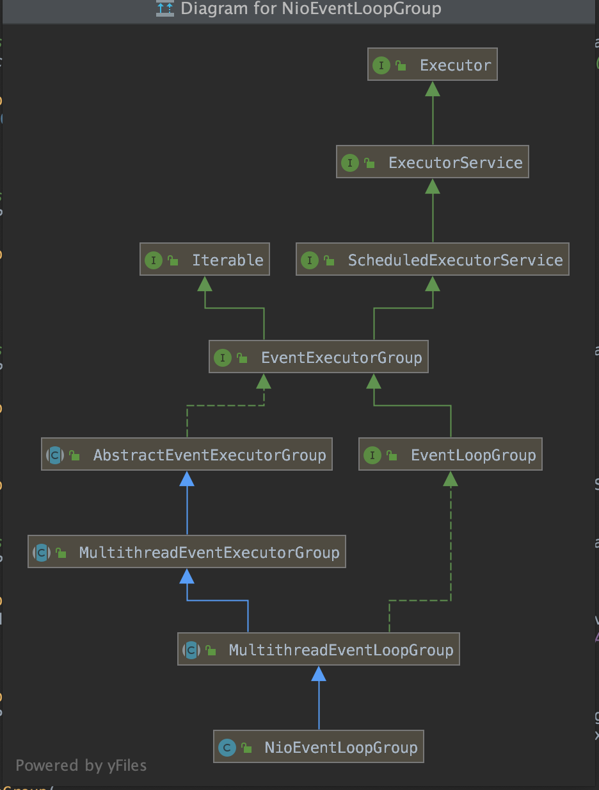

# netty4.x使用详解

## 1.环境

- jdk11
- netty 4.1.43.Final

### 1.1介绍

netty是异步事件驱动网络框架，提供快速开发高性能和高可靠网络协议服务和客户端，[官网地址](https://netty.io/index.html) ,

netty底层实现采用nio实现，所以必须了解selector模型

## 2 nio流程图


服务端：

selector线程：监听socket事件，例如连接事件 可读事件等

服务端channel ：处理客户连接和读写请求，和selector是不同线程，两者异步处理各自业务

客户端：

channel直接连接服务器

## 3.EventLoopGroup和线程池模型




`EventLoopGroup`继承`ScheduledExecutorService`接口，增强了jdk并发包下线程池功能，`NioEventLoopGroup`默认线程大小`NettyRuntime.availableProcessors() * 2` ，线程池处理IO任务


一旦一个channel被分配个一个EventLoop,它将在他的整个生命周期都使用整个`EventLoop`(以及相关联的Thread)，请记住这一点，因为它可以使你从担忧你的channelHandler实现中的线程安全和同步问题解脱出来


##4.服务端ServerBootstrap引导类

服务端代码片段

```java
EventLoopGroup bossGroup = new NioEventLoopGroup(); // (1)
        EventLoopGroup workerGroup = new NioEventLoopGroup();
        try {
            ServerBootstrap b = new ServerBootstrap(); // (2)

            b.group(bossGroup, workerGroup)
                    .channel(NioServerSocketChannel.class) // (3)
                    .childHandler(new ChannelInitializer<SocketChannel>() { // (4)
                        @Override
                        public void initChannel(SocketChannel ch) throws Exception {
                            ch.pipeline().addLast(new DiscardServerHandler());
                        }
                    })
                    .option(ChannelOption.SO_BACKLOG, 128)          // (5)
                    .childOption(ChannelOption.SO_KEEPALIVE, true); // (6)

            // 绑定和接受请求
            ChannelFuture f = b.bind(port).sync(); // (7)

          
            // 关闭
            f.channel().closeFuture().sync();
        } finally {
            workerGroup.shutdownGracefully();
            bossGroup.shutdownGracefully();
        }
```


## 5下面案例分析

服务端代码

```java
……………………   
public void run() throws Exception {
        // (1)创建处理serverChannel线程池
        EventLoopGroup bossGroup = new NioEventLoopGroup();
        //创建处理连接线程池
        EventLoopGroup workerGroup = new NioEventLoopGroup();
        try {
            // (2)创建服务端引导类
            ServerBootstrap b = new ServerBootstrap();

            //设置父子线程池关系
            b.group(bossGroup, workerGroup)
                    // (3)服务端使用selector模型
                    .channel(NioServerSocketChannel.class)
                    // (4)设置处理channel管道数据handler
                    .childHandler(new ChannelInitializer<SocketChannel>() {
                        @Override
                        public void initChannel(SocketChannel ch) throws Exception {
                            ch.pipeline().addLast(new StringEncoder(CharsetUtil.UTF_8));
                            ch.pipeline().addLast(new StringDecoder(CharsetUtil.UTF_8));
                            ch.pipeline().addLast(new DiscardServerHandler());

                        }
                    })
                    // (5)
                    .option(ChannelOption.SO_BACKLOG, 128)
                    // (6)
                    .childOption(ChannelOption.SO_KEEPALIVE, true);

             //(7) 绑定和等待接收请求
            ChannelFuture f = b.bind(port).sync();


            // （8）关闭channel
            f.channel().closeFuture().sync();
        } finally {
            workerGroup.shutdownGracefully();
            bossGroup.shutdownGracefully();
        }
    }
………………
```

客户端代码

```java
public class DiscardClient {
    public static void main(String[] args) {
        //创建发送数据线程池
        EventLoopGroup group = new NioEventLoopGroup();
        //设置客户端引导类
        Bootstrap bootstrap = new Bootstrap();


        bootstrap.group(group).
                //设置selector模型
                channel(NioSocketChannel.class).
                //添加处理连接请求handler
                handler(new ChannelInitializer<SocketChannel>() {
                    @Override
                    protected void initChannel(SocketChannel ch) throws Exception {
                        ch.pipeline().addLast(new StringEncoder(CharsetUtil.UTF_8));
                        ch.pipeline().addLast(new StringDecoder(CharsetUtil.UTF_8));
                        ch.pipeline().addLast(new DiscardClientHandler());
                    }
                });

        //设置请求连接配置
        ChannelFuture future = bootstrap.connect(new InetSocketAddress("127.0.0.1",8088));

        future.addListener(new ChannelFutureListener() {
            @Override
            public void operationComplete(ChannelFuture future) throws Exception {
                    if (future.isSuccess()){
                        System.out.println("connn estable");
                    }else {
                        System.out.println("connn faild");
                        future.cause().printStackTrace();
                    }
            }
        });
    }
}
```

[源码地址](https://github.com/knowledgeAlan/arts-twevle/tree/master/arts-twevle)
